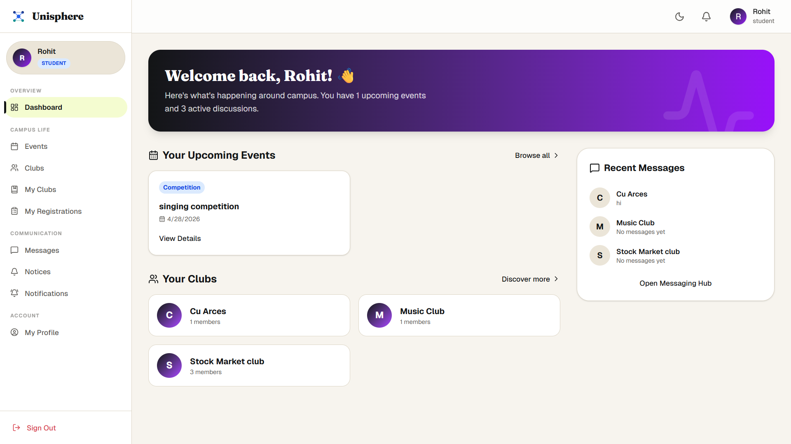
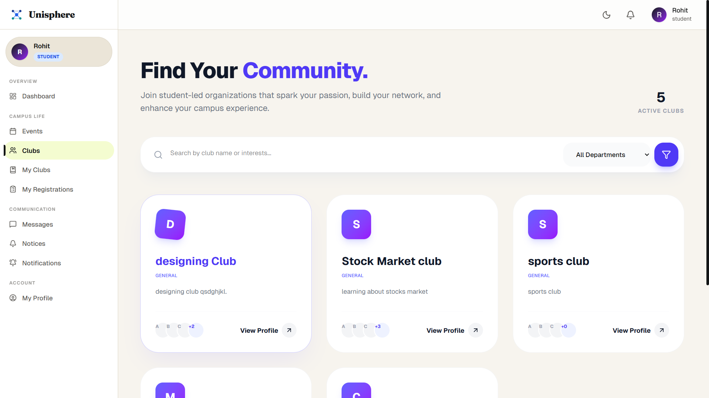
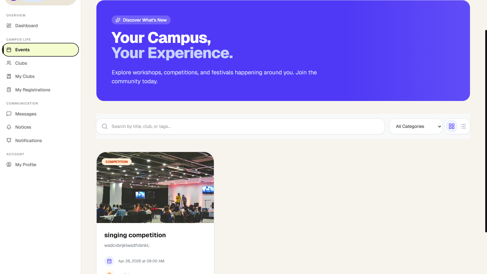
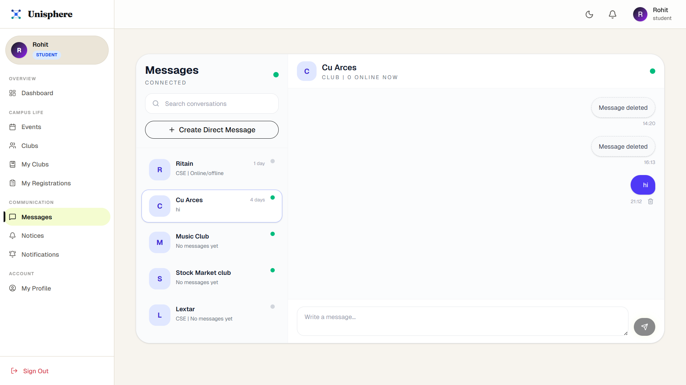
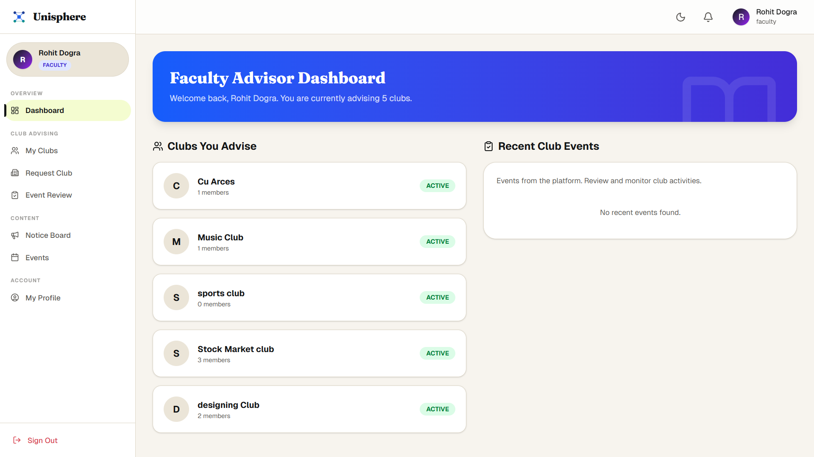
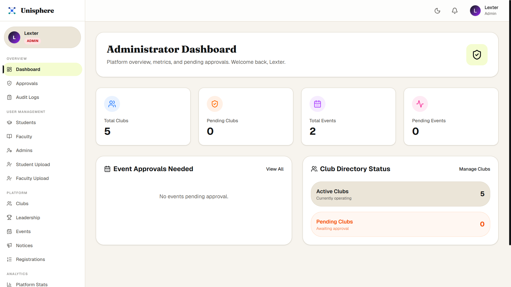

<div align="center">

# 🌐 Unisphere
### *One platform for every club, every event, every student.*

[](https://reactjs.org/)
[](https://nodejs.org/)
[](https://expressjs.com/)
[](https://www.mongodb.com/)
[](https://tailwindcss.com/)
[](https://www.framer.com/motion/)
[](https://jwt.io/)
[](https://socket.io/)

</div>

---

## 📖 About the Project

Unisphere is a unified university platform that solves the three biggest pain points in campus life: **club discovery, event awareness, and communication chaos.** Every university has dozens of clubs and events, yet students — especially freshers — routinely miss out because there is no single, structured place to find, join, and engage with them.

Unisphere replaces scattered WhatsApp groups, paper flyers, and word-of-mouth with a structured, approval-gated, interest-driven platform.

> **The Core Insight:** University club and event management is broken not because of lack of interest — but because of lack of infrastructure. Unisphere is that infrastructure.

### The Problem

---

## ✨ Key Features

### 🎯 Interest-Based Club Discovery
Students select interest tags on signup. Unisphere surfaces a curated, relevance-ranked shortlist of clubs instantly — the highest-impact moment for freshers. One-click join. No forms.

### 📅 Event Lifecycle & Approval Workflow
Every event is faculty-gated before going live:
```
📝 Draft  →  ⏳ Pending Review  →  ✅ Approved  →  🎉 Active  →  🔒 Closed
```
Club admins create events. Faculty advisors approve or reject with written reasons. Only approved events are visible for registration.

### 📊 Student Dashboard
Upcoming registered events, joined clubs, active group chats, and notifications from joined clubs only — all in one place.

### 👨‍🏫 Faculty Approval System
Every club is mandatorily linked to a faculty advisor — no club can exist without one. Advisors get a dedicated dashboard to review pending events with approve/reject + written feedback.


---

## 🖼️ Screenshots

| Student Dashboard | Club Discovery | Event Flow |
|:-:|:-:|:-:|
|  |  |  |

| Group Chat | Faculty Panel | Super Admin |
|:-:|:-:|:-:|
|  |  |  |

---

## 🛠️ Technology Stack

### Frontend
| Technology | Purpose |
|------------|---------|
| React.js | UI framework |
| Tailwind CSS | Utility-first styling & responsive layout |
| Framer Motion | Animations & page transitions |
| React Router v6 | Client-side routing |
| Axios | HTTP API requests |
| Socket.io-client | Real-time group chat |

### Backend
| Technology | Purpose |
|------------|---------|
| Node.js + Express.js | REST API server |
| MongoDB + Mongoose | Database & schema validation |
| Socket.io | Real-time bidirectional messaging |
| BullMQ + Redis | Background jobs for auto-group dissolution |
| Firebase Admin SDK | Push notifications via FCM |
| JSON Web Tokens | Stateless authentication |
| bcrypt.js | Password hashing |

---

## 🚀 Getting Started

### Prerequisites

- [Node.js](https://nodejs.org/) `v18+`
- [MongoDB](https://www.mongodb.com/) (local or [Atlas](https://cloud.mongodb.com/))
- [Redis](https://redis.io/) — required for BullMQ group-dissolution jobs
- [Git](https://git-scm.com/)

### Installation

**1. Clone the repository**
```bash
git clone https://github.com/rohit6709/Unisphere.git
cd Unisphere
```

**2. Setup the Backend**
```bash
cd backend
npm install
```

Create a `.env` file inside `/backend`:
```env
# Server
PORT=5000

# Database
MONGODB_URI=your_mongodb_connection_string

# Authentication
ACCESS_TOKEN_SECRET=your_access_token_secret
ACCESS_TOKEN_EXPIRY=1d
REFRESH_TOKEN_SECRET=your_refresh_token_secret
REFRESH_TOKEN_EXPIRY=7d

# Email
EMAIL_USER=your_email@example.com
EMAIL_PASSWORD=your_email_password

# Super Admin Seed
SUPERADMIN_NAME=Admin Name
SUPERADMIN_EMAIL=admin@example.com
SUPERADMIN_PASSWORD=strong_password_here

# CORS
FRONTEND_URL=http://localhost:5173

# Redis
REDIS_HOST=your_redis_host
REDIS_PORT=6379
REDIS_PASSWORD=your_redis_password
```

**3. Setup the Frontend**
```bash
cd ../frontend
npm install
```

Create a `.env` file inside `/frontend`:
```env
VITE_API_BASE_URL=http://localhost:5000/api/v1
VITE_SOCKET_URL=http://localhost:5000
```

### Running the App

```bash
# Terminal 1 — Redis (required for background jobs)
redis-server

# Terminal 2 — Backend
cd backend && npm start

# Terminal 3 — Frontend
cd frontend && npm run dev
```

| Service | URL |
|---------|-----|
| Frontend | `http://localhost:5173` |
| Backend API | `http://localhost:5000/api/v1` |

---

## 🔒 Security Protocols
 
## 🔒 Security Protocols

- JWT access + refresh token rotation — verified on every protected route
- Passwords hashed with `bcrypt` — never stored in plain text
- Role-based access control across 4 roles — `student`, `faculty`, `admin`, `superAdmin` — enforced at middleware level before controllers are reached
- Rate limiting applied across all API endpoints — socket connections excluded
---

## 📄 License

This project is licensed under the **MIT License** — see the [LICENSE](LICENSE) file for details.

---